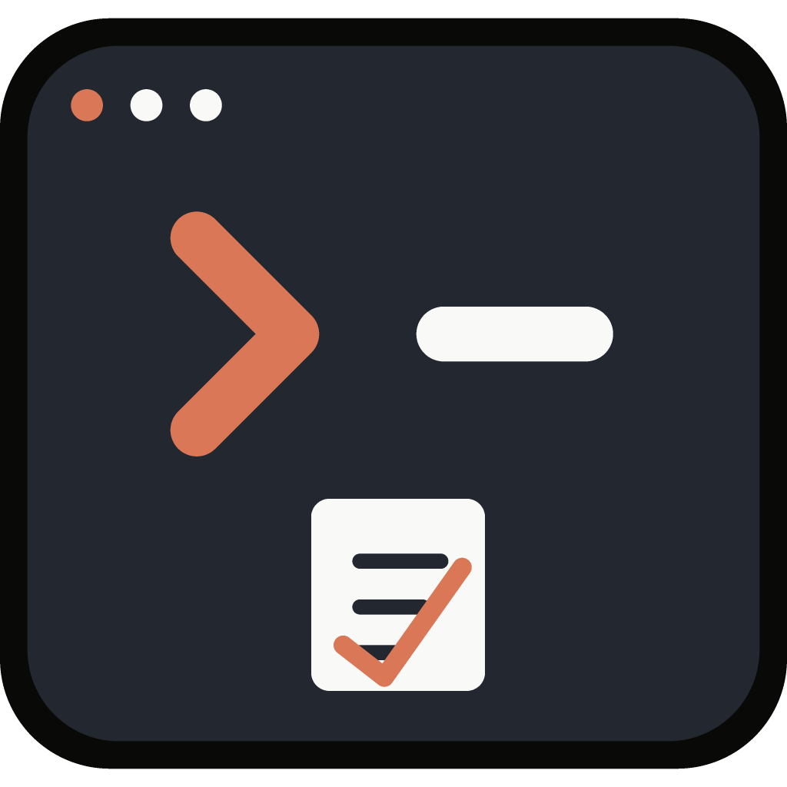

<p align="center">
  
</p>

<h1 align="center">@refinist/ccsa</h1>

<p align="center">
  <a href="README.md">English</a> | <strong>简体中文</strong>
</p>

<p align="center">
  <strong>CCStatusline Apply</strong>——把
  <a href="https://github.com/sirmalloc/ccstatusline">ccstatusline</a>
  配置直接写入磁盘，并自动备份旧文件。
</p>

<p align="center">
  <a href="https://ccse.refineup.com"><strong>在编辑器中生成配置 →</strong></a>
</p>

## 用法

```sh
# 粘贴编辑器给你的 JSON（单引号包裹、单行）——apply 是默认命令，可以省略这个词：
npx -y @refinist/ccsa@latest '{"version":3,"lines":[[]]}'

# ……或者指向一个下载好的配置文件：
npx -y @refinist/ccsa@latest -f ./ccstatusline-settings.json

# ……或者用管道传入 JSON：
cat ccstatusline-settings.json | npx -y @refinist/ccsa@latest --stdin

# 查看当前配置和全部备份：
npx -y @refinist/ccsa@latest list

# 撤销——回滚到最近一次备份：
npx -y @refinist/ccsa@latest restore

# 把当前配置取回来（自动复制到剪贴板），方便在编辑器里继续调整：
npx -y @refinist/ccsa@latest export

# 删除这份配置的全部备份：
npx -y @refinist/ccsa@latest clean
```

## 它做了什么

把 [ccstatusline-editor](https://github.com/refinist/ccstatusline-editor) 生成的
[ccstatusline](https://github.com/sirmalloc/ccstatusline) 配置直接写入你本地的
`~/.config/ccstatusline/settings.json`——写入前自动给旧文件打一份带时间戳的备份。

编辑器跑在浏览器里，没法直接写磁盘。这个小工具就是那座桥：从编辑器复制一条命令，粘贴运行，完事。
下一次状态栏刷新就会读到新配置——不用重启、不用写包装脚本、也不用手动改 `~/.claude/settings.json`。

1. 解析并校验配置（必须是包含 `version` + `lines` 的 JSON 对象）。
2. 定位 `~/.config/ccstatusline/settings.json`（目录不存在会自动创建）。
3. 把当前文件复制为一份带时间戳的备份 `~/.config/ccsa/settings.<YYYY-MM-DD_HH-MM-SS>.json`——
   独立的目录，跟 ccstatusline 自己的配置目录分开，所以 ccstatusline 升级不会碰到你的备份历史。
4. **保留** ccstatusline 自己管理的键（尤其是 `installation`）——应用新配置不会丢掉工具自身的
   记录信息，编辑器管理的部分才会被替换。
5. 原子方式写入新文件（临时文件 + 重命名），并**保留原文件的权限位**。

每次 apply 都会留一份独立备份——从不覆盖，所以你随时可以回退。`restore` 会把配置文件回滚到
**最新**的那份备份，回滚前会先保存当前文件，所以回滚本身也可以撤销——也就是说每次 `restore`
都会再多产生一份备份,而不是在两个文件之间简单切换;备份池只会在你运行 `clean` 时才会缩小。

`export` 把当前配置文件原样（不重新格式化）打印到 stdout——这是桥的另一个方向,当你想继续在
编辑器里调整一份已经应用过的配置时用得上。在终端直接运行时,它还会尝试把 JSON 复制到剪贴板
（`pbcopy` / `clip` / `wl-copy` / `xclip` / `xsel`,平台有什么用什么）;如果是管道或重定向
（`export | pbcopy`、`export > out.json`）,就只有 stdout 携带 JSON,和其他 Unix 命令一样可以组合使用。

`clean` 会删除这份配置的全部备份——不可恢复,之后 `restore` 也没有可回滚的对象了。正在使用的
`settings.json` 本身不会被动。

额外的安全措施:

- 如果配置文件是**软链接**（用 stow/chezmoi 管理的 dotfiles）,会穿透链接写入——链接本身保留,
  更新的是它指向的真实文件,而不是把链接替换成普通文件。
- 如果现有文件已经损坏,仍然会被备份,但不会从它那里合并数据。
- stdin 是按需开启的:只有加了 `--stdin` 才会读取,不会自动检测。

## 命令

| 命令                   | 说明                                      |
| ---------------------- | ----------------------------------------- |
| `apply <json\|base64>` | 应用一份配置（原始 JSON 或 base64）       |
| `list`                 | 显示当前配置和备份池里的全部备份          |
| `restore`              | 回滚到最新的 `settings.<date>.json` 备份  |
| `export`               | 把当前配置打印到 stdout（并复制到剪贴板） |
| `clean`                | 删除这份配置的全部备份                    |

`apply` 是默认命令,这个词本身可以省略:`ccsa '<json>'` 效果一样。如果要写命令词,必须放在最前面:
是 `ccsa restore`,不是 `ccsa --restore`。

## 选项

| 选项                | 说明                                                         |
| ------------------- | ------------------------------------------------------------ |
| `-f, --file <path>` | 从 JSON 文件读取配置（用于 `apply`）                         |
| `--stdin`           | 从 stdin 读取配置（用于 `apply`）                            |
| `--no-backup`       | 跳过带时间戳的备份（用于 `apply` / `restore`）               |
| `--no-merge`        | 替换整个文件（丢弃 `installation` 及未知键）（用于 `apply`） |
| `-h, --help`        | 显示帮助                                                     |
| `-v, --version`     | 打印版本号                                                   |

位置参数如果以 `{` 开头会被当作原始 JSON 处理,否则按 base64 处理。

## 配置文件位置

`ccstatusline` 在所有平台上都读取写死的 `~/.config/ccstatusline/settings.json`——没有
`XDG_CONFIG_HOME` 或 Windows `APPDATA` 的特殊处理——所以这个工具永远只写这个确切路径(没有
`--config` 覆盖选项:写到别的地方的配置本来 ccstatusline 也读不到)。备份存放在独立的
`~/.config/ccsa/` 目录(同样是 `homedir()/.config/…` 这套方案,只是换了个文件夹),和
ccstatusline 本身互不干扰。想测试一个临时路径的话,调用时覆盖 `$HOME` 环境变量即可(见下面的
"本地开发")。

## 本地开发

不需要构建也不需要 `npx`——Node 24 可以直接运行 TypeScript 源码:

```sh
node src/cli.ts --help                                              # 直接运行 CLI
HOME=/tmp/ccsl-test node src/cli.ts '{"version":3,"lines":[[]]}'     # 安全测试,不会碰到真实配置
pnpm dev -- --help                                                   # 同上,带 --watch
pnpm test                                                            # 对 .ts 源码跑 vitest
pnpm build                                                           # tsc → dist/(发布的就是这份产物)
```

手动测试时务必覆盖 `$HOME`,这样才不会不小心覆盖掉你真实的
`~/.config/ccstatusline/settings.json`。

## License

[MIT](./LICENSE)

Copyright (c) 2026-present, [REFINIST](https://github.com/refinist)
